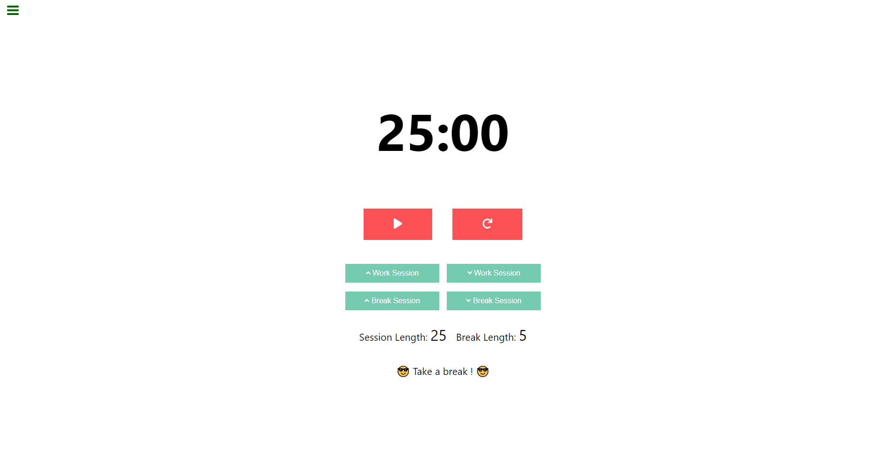

# React Pomodoro

A Pomodoro web app built with React and ❤️ as part of the FreeCodeCamp Front-end certification. 
The specification page can be found here: [Build a Pomodoro Clock](https://learn.freecodecamp.org/front-end-libraries/front-end-libraries-projects/build-a-pomodoro-clock)

[Live demo](https://mattldwig.github.io/react-pomodoro/)

---

## Installation

Clone the repo `git clone https://github.com/MattLdwig/react-pomodoro.git`

Install dependencies `npm install`

Start with `npm start` and open [http://localhost:3000](http://localhost:3000) to view it in the browser.

---

## How to use

1. Choose the length of your work & break session by clicking on the appropriate buttons (each button increase or decrease the length of a session by 1min). Default session length: 25min of work, 5min of break.

2. Press the play button.

### License

This application was made with [Create React App](https://github.com/facebook/create-react-app) and [licensed as MIT](License.md).